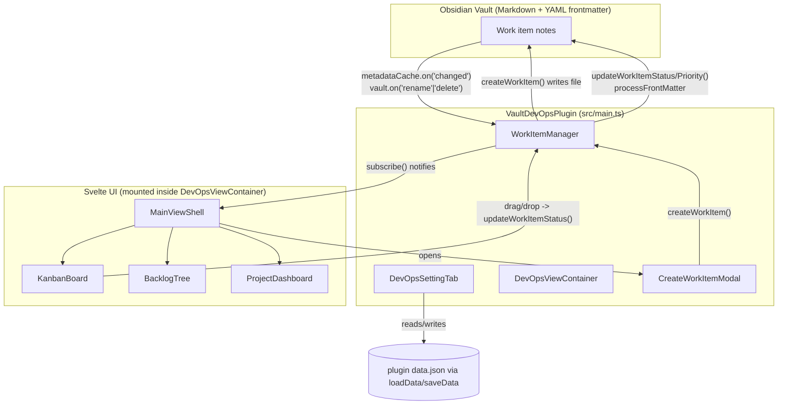

# Vault DevOps Plugin Architecture

## Overview

Vault DevOps (`vault-devops`) is an Obsidian plugin that brings JIRA/Azure DevOps-style
agile project management into an Obsidian vault. Work items (epics, features, stories,
tasks, bugs) are plain Markdown notes with YAML frontmatter — there is no external
database or file format. The plugin indexes these notes in memory, and exposes a
Kanban board, a hierarchical backlog tree, and a metrics dashboard through a single
custom `ItemView` built with Svelte 4.

The core design principle is that the vault itself is the source of truth: creating,
editing, or deleting a work item's Markdown file (via the plugin's UI, manual editing,
sync, or any other tool) is reflected through Obsidian's `metadataCache` and `vault`
events, which keep the plugin's in-memory index — and therefore the UI — in sync.

## Architecture Diagram

## Components

### Plugin Bootstrap

**Purpose**: Entry point; wires together settings, the data engine, the custom view,
commands, and the ribbon icon; owns the plugin lifecycle.

**Location**: `src/main.ts`

**Key Symbols**:
- `VaultDevOpsPlugin` (extends Obsidian `Plugin`)
- `onload()` — loads settings, constructs `WorkItemManager`, calls `registerView`,
  `addRibbonIcon`, `addCommand` (×3: open board, create work item, re-index vault),
  `addSettingTab`; defers `workItemManager.initialize()` until
  `workspace.onLayoutReady()`
- `onunload()` — detaches leaves of `VIEW_TYPE_DEVOPS`
- `activateView()` — finds or creates the single `DevOpsViewContainer` leaf and reveals it
- `loadSettings()` / `saveSettings()` — merge `DEFAULT_SETTINGS` with `loadData()`;
  persist via `saveData()`

**Interactions**:
- Constructs and holds the single `WorkItemManager` instance for the plugin's lifetime.
- Registers `DevOpsViewContainer` as a factory for `VIEW_TYPE_DEVOPS`.
- Registers `DevOpsSettingTab` for the plugin settings pane.

### Data Model & Settings

**Purpose**: Shared TypeScript types for work items, project configuration, and plugin
settings; defines the default configuration.

**Location**: `src/types.ts`

**Key Symbols**:
- `WorkItemType` = `'epic' | 'feature' | 'story' | 'task' | 'bug'`
- `WorkItemStatus` = `'To Do' | 'In Progress' | 'In Review' | 'Done'` (configurable per-vault via settings)
- `WorkItemPriority` = `'Low' | 'Medium' | 'High' | 'Urgent'`
- `WorkItem` — in-memory representation of a work item (id, title, type, status,
  priority, project, parentId, assignee, estimate, tags, filePath, timestamps)
- `ProjectConfig` — `key`, `name`, `folder`, `nextId` (auto-increment counter for IDs
  like `PROJ-101`)
- `DevOpsSettings` — `projects`, `defaultProjectKey`, `statuses`, `defaultFolder`,
  `usePrefixKeys`
- `DEFAULT_SETTINGS` — seeds one project (`PROJ`) with 4 default statuses

**Interactions**: Imported by every other component; has no dependencies of its own.

### WorkItemManager (data engine)

**Purpose**: The single source of truth for the plugin's in-memory work item index.
Keeps that index synchronized with the vault's Markdown files and exposes CRUD
operations that write back to frontmatter.

**Location**: `src/models/WorkItemManager.ts`

**Key Symbols**:
- `itemsMap: Map<filePath, WorkItem>` — the index, keyed by file path
- `initialize()` — registers three vault-lifecycle listeners via `plugin.registerEvent()`
  (memory-safe, auto-unbound on plugin unload):
  `metadataCache.on('changed')`, `vault.on('rename')`, `vault.on('delete')`; then
  calls `indexVault()`
- `indexVault()` — full rescan of `vault.getMarkdownFiles()`, rebuilding `itemsMap`
- `parseWorkItemFromFile(file)` — reads `metadataCache.getFileCache(file).frontmatter`;
  returns `null` (and the file is excluded from the index) unless a recognized `type`/
  `devops-type` key is present. Supports two frontmatter key schemes simultaneously:
  prefixed (`devops-id`, `devops-status`, …) and unprefixed (`id`, `status`, …),
  controlled by `settings.usePrefixKeys` for *new* items but read leniently for
  *existing* items either way. Resolves a parent reference expressed as a bare ID or
  as an Obsidian `[[wikilink]]`.
- `subscribe(callback)` — pub/sub registration; UI components call this to receive
  index-changed notifications and return an unsubscribe function
- `createWorkItem(params)` — allocates the next ID from the project's `nextId` counter,
  persists the incremented counter via `saveSettings()`, builds a sanitized file path
  under the project's folder, writes YAML frontmatter + a templated body via
  `vault.create()`, and inserts the new item into `itemsMap` immediately (rather than
  waiting for the `metadataCache` event)
- `updateWorkItemStatus(filePath, status)` / `updateWorkItemPriority(filePath, priority)`
  — use `app.fileManager.processFrontMatter()` to mutate just the relevant frontmatter
  key (auto-detecting prefixed vs. unprefixed based on what the file already has), then
  update the in-memory item and notify subscribers
- `openWorkItemFile(filePath)` — opens the note in the workspace's "unsplit" leaf
- `getAllItems()` / `getItemsByProject(key)` — read accessors used by the UI

**Interactions**:
- Receives input from: Obsidian's `vault`/`metadataCache` events, `CreateWorkItemModal`,
  `KanbanBoard` (drag-and-drop).
- Sends output to: Markdown files in the vault (via `vault.create` /
  `processFrontMatter`); UI components (via `subscribe()` notifications and the
  `getAllItems()`/`getItemsByProject()` accessors).

### Settings Tab

**Purpose**: Obsidian settings-pane UI for configuring where new work items are stored
and how projects are defined.

**Location**: `src/settings.ts`

**Key Symbols**:
- `DevOpsSettingTab` (extends `PluginSettingTab`)
- `display()` — renders: default storage directory, "use prefix keys" toggle, a list
  of configured projects (each editable/deletable, using native `prompt()`/`alert()`
  dialogs rather than a modal), and an "Add Project" action

**Interactions**: Reads and writes `plugin.settings` directly, then calls
`plugin.saveSettings()`; does not go through `WorkItemManager`.

### View Layer

**Purpose**: Renders the plugin's main UI (Kanban / Backlog / Dashboard) inside a
standard Obsidian workspace leaf, and bridges the Svelte component tree's lifecycle to
Obsidian's `ItemView` lifecycle.

**Location**: `src/views/DevOpsViewContainer.ts`, `src/components/*.svelte`

**Key Symbols**:
- `DevOpsViewContainer` (extends `ItemView`), `VIEW_TYPE_DEVOPS = 'vault-devops-view'`
  — `onOpen()` mounts a `MainViewShell` Svelte component into `contentEl`, passing
  `app`, `plugin`, and `workItemManager` as props; `onClose()` calls `$destroy()` on it
- `MainViewShell.svelte` — owns the top navbar (project selector, view-switcher tabs,
  "+ New Item" button), the search/filter toolbar (text search, type-filter pills,
  status dropdown), and holds the `items` array. Subscribes to `workItemManager` on
  `onMount`/unsubscribes on `onDestroy`. Derives `filteredItems` reactively and passes
  it down to whichever child view is active.
- `KanbanBoard.svelte` — renders one column per status; HTML5 drag-and-drop
  (`dragstart`/`dragover`/`drop`) moves a card between columns, calling
  `workItemManager.updateWorkItemStatus(filePath, newStatus)` on drop; clicking a card
  opens the underlying note via `workItemManager.openWorkItemFile()`
- `BacklogTree.svelte` — three-tier hierarchy (Epic → Story/Feature → Task/Bug) built
  by matching `parentId` (or `[[parentId]]`) against item IDs; computes progress
  rollup bars (`getProgressRollup`) as `done/total` of direct children; items without
  a resolvable parent are listed separately under "Standalone" sections; "+ Child" /
  "+ Task" buttons invoke `onCreateChild`, which `MainViewShell` wires to open
  `CreateWorkItemModal` pre-filled with the parent ID and an inferred child type
- `ProjectDashboard.svelte` — purely derived metrics (counts by status/type/priority,
  completion rate, total estimate) rendered as counter cards and percentage bar charts;
  has no side effects

**Interactions**:
- Receives input from: `WorkItemManager` (`getAllItems()` at mount, then push updates
  via `subscribe()`), `plugin.settings` (projects, statuses).
- Sends output to: `WorkItemManager` (status/priority updates, `openWorkItemFile`),
  `CreateWorkItemModal` (opened with contextual defaults).

### Work Item Creation Flow

**Purpose**: Modal form for creating a new work item note, usable standalone (command
palette / "+ New Item") or contextually (backlog tree's "+ Child" / "+ Task").

**Location**: `src/modals/CreateWorkItemModal.ts`

**Key Symbols**:
- `CreateWorkItemModal` (extends Obsidian `Modal`) — constructor accepts optional
  `initialProjectKey`, `initialParentId`, `initialType` to pre-populate the form
- `onOpen()` — builds the form (title, project dropdown, type dropdown, status
  dropdown, priority dropdown, parent ID text field, assignee, estimate, description
  textarea) and a submit handler that calls `workItemManager.createWorkItem(...)`

**Interactions**: Only interacts with `WorkItemManager.createWorkItem()`; does not
touch the vault or frontmatter directly.

## Data Flow

1. **Startup**: `VaultDevOpsPlugin.onload()` constructs `WorkItemManager`; once the
   workspace layout is ready, `initialize()` registers vault event listeners and runs
   a full `indexVault()`, populating `itemsMap` from every Markdown file's frontmatter.
2. **Rendering**: When a user opens the Vault DevOps view (ribbon icon or command),
   `DevOpsViewContainer.onOpen()` mounts `MainViewShell`, which pulls the current
   snapshot via `getAllItems()` and subscribes for future changes.
3. **External edits**: Any change to a note's frontmatter fires
   `metadataCache.on('changed')`; `WorkItemManager` re-parses just that file, updates
   `itemsMap`, and calls `notifyListeners()`, which triggers `MainViewShell` to
   re-pull `getAllItems()` and Svelte's reactivity (`$:`) recomputes `filteredItems`
   and re-renders the active view.
4. **UI-driven writes**: Dragging a Kanban card, creating an item via the modal, or
   (indirectly) editing a note all funnel through `WorkItemManager`'s write methods
   (`createWorkItem`, `updateWorkItemStatus`, `updateWorkItemPriority`), which mutate
   the Markdown file first (frontmatter is the durable state) and then update
   `itemsMap`/notify listeners immediately, so the UI does not wait for the
   `metadataCache` event to catch up.
5. **Rename/delete**: `vault.on('rename')` re-keys the item under the new path;
   `vault.on('delete')` removes it from `itemsMap`. Both notify listeners.

## Configuration

- **Plugin settings** are persisted through Obsidian's standard
  `Plugin.loadData()`/`saveData()` (a `data.json` file inside the plugin folder),
  merged over `DEFAULT_SETTINGS` (`src/types.ts`) on load.
- **`defaultFolder`** — vault-relative folder used when a project doesn't specify its
  own `folder`.
- **`usePrefixKeys`** — toggles whether *new* items are written with `devops-`-prefixed
  frontmatter keys (`devops-id`, `devops-type`, …) or bare keys (`id`, `type`, …).
  Existing files are always read leniently, accepting either scheme
  (`parseWorkItemFromFile` in `WorkItemManager.ts`).
- **`projects`** (`ProjectConfig[]`) — each project has a `key` (ID prefix, e.g.
  `PROJ`), `name`, `folder`, and `nextId` counter; managed through `DevOpsSettingTab`
  (`src/settings.ts`) using native `prompt()`/`alert()` dialogs.
- **`statuses`** — the ordered list of Kanban columns / valid `WorkItemStatus` values;
  configurable per-vault (default: `To Do`, `In Progress`, `In Review`, `Done`).
- **Recognizing a note as a work item**: any Markdown file with a `type` (or
  `devops-type`) frontmatter key whose value is one of `epic`, `feature`, `story`,
  `task`, `bug` is indexed. No folder restriction is enforced at parse time — only
  `createWorkItem()` writes new files under a project's configured folder.
- **Build**: `esbuild.config.mjs` bundles `src/main.ts` via esbuild + `esbuild-svelte`
  (with `svelte-preprocess`) into `main.js` (CJS, ES2022 target), treating `obsidian`,
  `electron`, and CodeMirror/Lezer packages as externals. `npm run dev` watches;
  `npm run build` produces a production build. Plugin identity/versioning lives in
  `manifest.json` (id `vault-devops`, `minAppVersion` `0.15.0`).

## Code References

| Component | File | Key Symbols |
|-----------|------|--------------|
| Plugin bootstrap | `src/main.ts` | `VaultDevOpsPlugin`, `onload()`, `activateView()` |
| Types & defaults | `src/types.ts` | `WorkItem`, `ProjectConfig`, `DevOpsSettings`, `DEFAULT_SETTINGS` |
| Data engine | `src/models/WorkItemManager.ts` | `WorkItemManager`, `parseWorkItemFromFile()`, `createWorkItem()`, `updateWorkItemStatus()`, `subscribe()` |
| Settings UI | `src/settings.ts` | `DevOpsSettingTab` |
| View container | `src/views/DevOpsViewContainer.ts` | `DevOpsViewContainer`, `VIEW_TYPE_DEVOPS` |
| Shell / filters | `src/components/MainViewShell.svelte` | `filteredItems`, `openCreateModal()` |
| Kanban view | `src/components/KanbanBoard.svelte` | `handleDrop()`, `openItem()` |
| Backlog view | `src/components/BacklogTree.svelte` | `getChildStories()`, `getProgressRollup()` |
| Dashboard view | `src/components/ProjectDashboard.svelte` | `typesCount`, `priorityCount` |
| Creation modal | `src/modals/CreateWorkItemModal.ts` | `CreateWorkItemModal` |
| Build config | `esbuild.config.mjs`, `manifest.json` | — |

## Glossary

| Term | Definition |
|------|------------|
| Work item | A Markdown note representing an epic/feature/story/task/bug, identified by a `type`/`devops-type` frontmatter key |
| Project key | Short uppercase prefix (e.g. `PROJ`) used both to namespace work item IDs (`PROJ-101`) and to group items in the UI's project selector |
| Prefix keys mode | Setting (`usePrefixKeys`) controlling whether new work items use `devops-`-prefixed frontmatter keys to avoid colliding with other plugins' use of plain `type`/`status`/etc. |
| Rollup | Backlog tree's progress indicator on an Epic or Story: percentage of its direct children whose status is `Done` |
| Index | `WorkItemManager`'s in-memory `Map<filePath, WorkItem>`, rebuilt from vault frontmatter and kept live via Obsidian vault events |
| Orphan item | A story/feature/task/bug whose `parentId` doesn't resolve to any indexed item; shown in the Backlog Tree's "Standalone" sections |

## Assumptions

This document reflects the plugin as built at `.obsidian/plugins/vault-devops` on
2026-07-30, matching `implementation_plan.md` at the vault root. It has not been
verified against a running Obsidian instance (no interactive test of drag-and-drop or
modal flows was performed).
